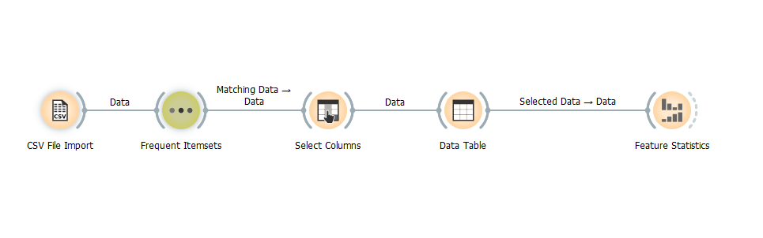
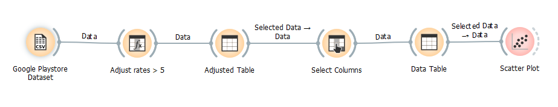
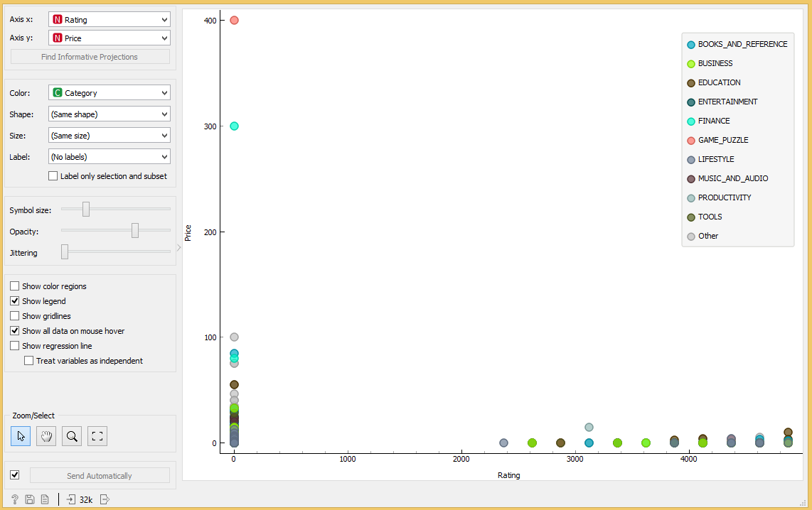
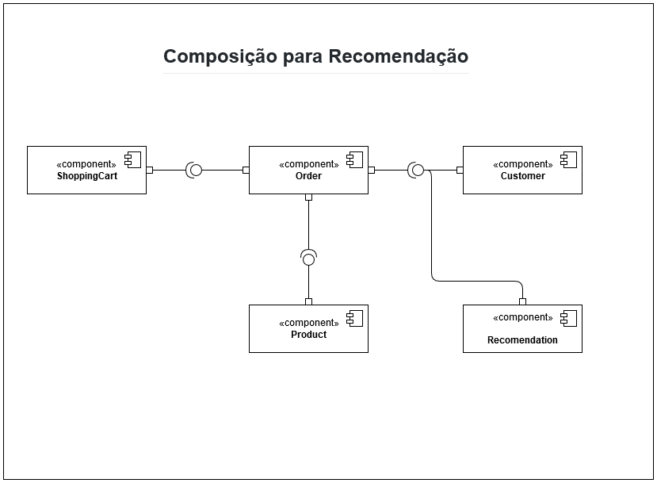
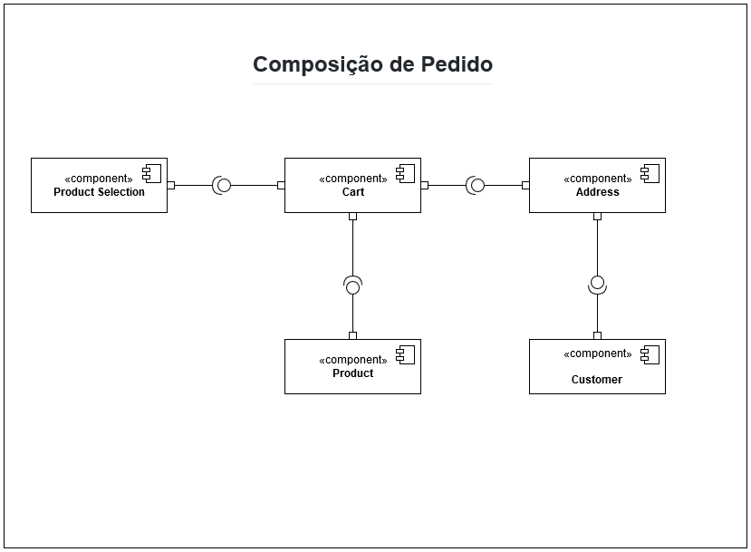
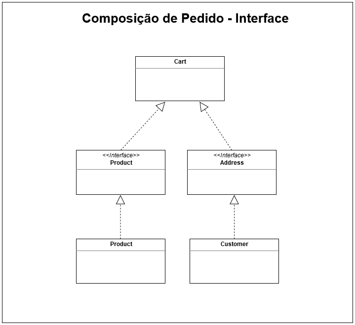

# Equipe
	
	Alexsandro Coltre Gusmão

# Apresentação do Lab01 - Data Flow
	
	Disciplina: INF331 - Componentização e Reuso de Software Conceitos e Práticas (2020)
	
# Projeto Orange / Regras de Associação para Foodmart

## Imagem do Projeto

## Arquivo do Projeto

[Projeto Orange Foodmart](orange/FoodMart/foodmart.ows)

# Projeto Orange / Análise de Dados do Google PlayStore

## Imagem do Projeto

## Arquivo do Projeto

[Projeto Orange Google PlayStore](orange/GooglePlayStore/google-playstore.ows)

## Gráfico(s) de Análise

# Projeto de Composição de Componentes para Recomendação

# Projeto de Composição de Componentes para Pedido

## Diagrama de Componentes

## Diagrama de Interfaces

