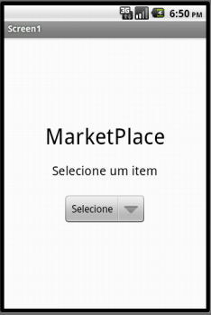
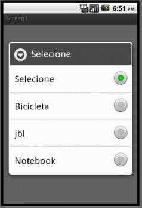
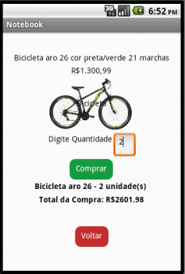
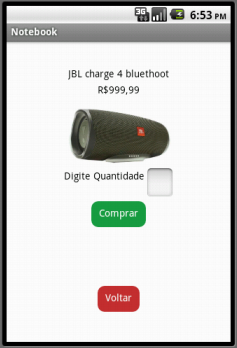
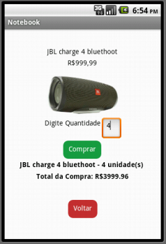
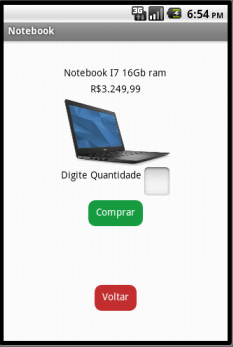
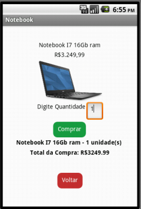
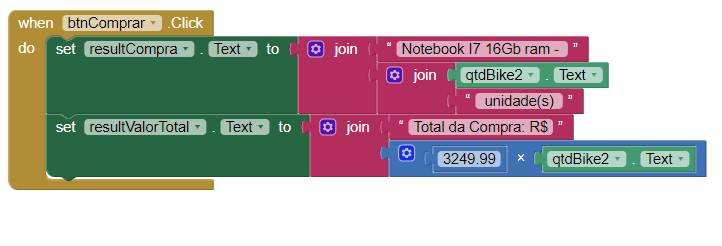

# Tarefa 01

# Tarefa 02

# Tarefa 03

### Imagem da Home do aplicativo

### Lista com as opções de produto

### Produto Bicicleta selecionado

### Quantidade do produto Bicicleta selecionado

### Produto JBL selecionado

### Quantidade do produto JBL selecionado

### Produto Notebook selecionado

### Quantidade do produto Notebook selecionado

- Exemplo do diagrama de blocos da tela de notebook

# Tarefa 04
link do repositorio da equipe 05 no github https://github.com/inf331Equipe05/equipe5