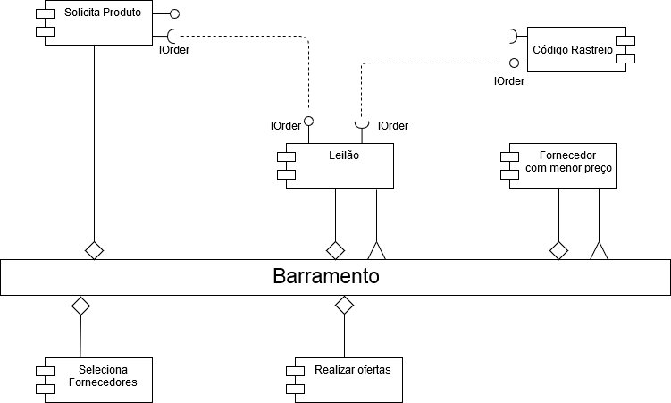
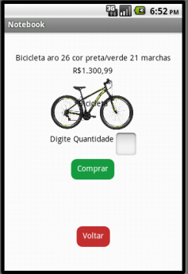

# Tarefa 01

# Tarefa 02

# Tarefa 03

### Tela 01 - Imagem da Home do aplicativo

### Tela 02 - Lista com as opções de produtos

### Tela 03 - Produto Bicicleta selecionado

### Tela 04 - Adicionado quantidade do produto Bicicleta e clicado no botão "comprar"

### Tela 05 - Produto JBL selecionado

### Tela 06 - Adicionado quantidade do produto JBL e clicado no botão "comprar"

### Tela 07 - Produto Notebook selecionado

### Tela 08 - Adicionado quantidade do produto Notebook e clicado no botão "comprar"

### Exemplo do diagrama de blocos da tela de notebook

# Tarefa 04
link do repositorio da equipe 05 no github https://github.com/inf331Equipe05/equipe5