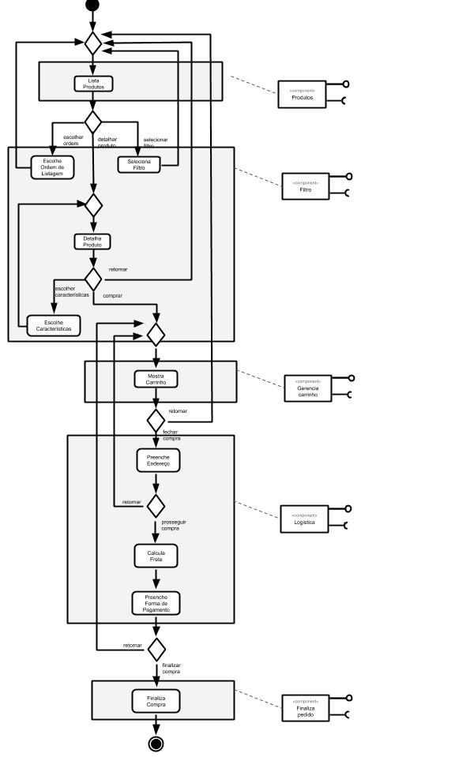
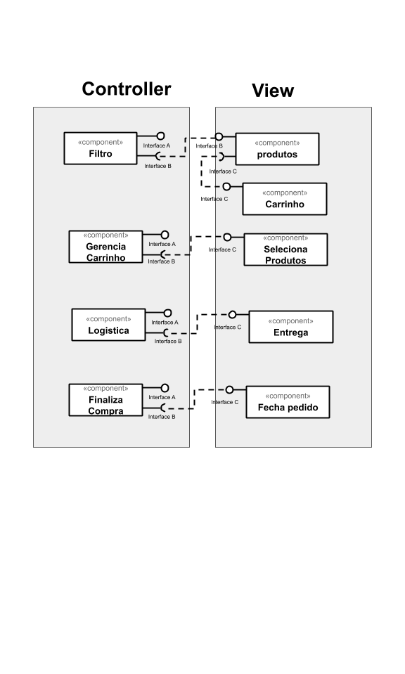
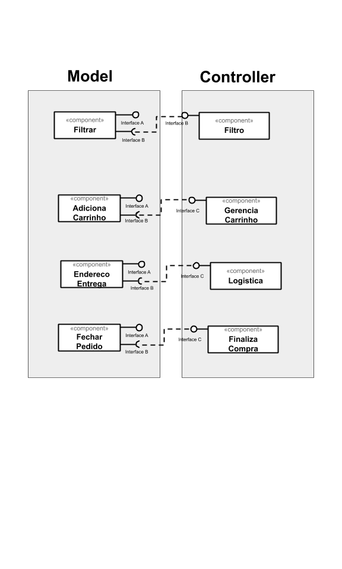

## Tarefa 1
> 

## Tarefa 2
> 

## Tarefa 3
> 
## Tarefa 4

### Serviço `Open Library`
* **Título do serviço**: `Books API`
* **Breve descrição**:
  > A API Open Library Books fornece um método do lado do cliente para consultar informações de livros usando Javascript.
* **URL completa da requisição**: `https://openlibrary.org/api/books?bibkeys=ISBN:0201558025,LCCN:93005405&format=json`

### Serviço Exemplo com parametro de ISBN e formato JSON
* **Cabeçalho HTTP da chamada**:
~~~http
Accept: text/html,application/xhtml+xml,application/xml;q=0.9,image/webp,image/apng,*/*;q=0.8,application/signed-exchange;v=b3;q=0.9
Accept-Encoding: gzip, deflate, br
Accept-Language: en-US,en;q=0.9,pt;q=0.8,fr;q=0.7
Cache-Control: max-age=0
Connection: keep-alive
Host: openlibrary.org
Sec-Fetch-Dest: document
Sec-Fetch-Mode: navigate
Sec-Fetch-Site: none
Sec-Fetch-User: ?1
Upgrade-Insecure-Requests: 1
User-Agent: Mozilla/5.0 (Windows NT 6.3; Win64; x64) AppleWebKit/537.36 (KHTML, like Gecko) Chrome/84.0.4147.135 Safari/537.36
~~~
* **Cabeçalho HTTP da resposta**:
~~~http
Access-Control-Allow-Method: GET, OPTIONS
Access-Control-Allow-Origin: *
Access-Control-Max-Age: 86400
Connection: keep-alive
Content-Type: application/json
Date: Fri, 28 Aug 2020 00:22:57 GMT
Server: nginx/1.4.6 (Ubuntu)
Transfer-Encoding: chunked
X-OL-Stats: "IB 2 0.063 MC 2 0.001 TT 0 0.068"
~~~
* **Parametros da chamada**:
~~~http
bibkeys: ISBN:0201558025,LCCN:93005405
format: json
~~~
* **Conteúdo da resposta**:
~~~json
{"LCCN:93005405": {"bib_key": "LCCN:93005405", "preview": "noview", "thumbnail_url": "https://covers.openlibrary.org/b/id/240726-S.jpg", "preview_url": "https://openlibrary.org/books/OL1397864M/Zen_speaks", "info_url": "https://openlibrary.org/books/OL1397864M/Zen_speaks"}, "ISBN:0201558025": {"bib_key": "ISBN:0201558025", "preview": "restricted", "thumbnail_url": "https://covers.openlibrary.org/b/id/135182-S.jpg", "preview_url": "https://archive.org/details/concretemathemat00grah_444", "info_url": "https://openlibrary.org/books/OL1429049M/Concrete_mathematics"}}
~~~
### Serviço Exemplo com parametro de ISBN, detalhes e formato JSON
* **Detalhes do livro no formato JSON**:
https://openlibrary.org/api/books?bibkeys=ISBN:9780980200447&jscmd=details&format=json
* **Cabeçalho HTTP da chamada**:
~~~http
Accept: text/html,application/xhtml+xml,application/xml;q=0.9,image/webp,image/apng,*/*;q=0.8,application/signed-exchange;v=b3;q=0.9
Accept-Encoding: gzip, deflate, br
Accept-Language: en-US,en;q=0.9,pt;q=0.8,fr;q=0.7
Cache-Control: max-age=0
Connection: keep-alive
Host: openlibrary.org
Sec-Fetch-Dest: document
Sec-Fetch-Mode: navigate
Sec-Fetch-Site: none
Sec-Fetch-User: ?1
Upgrade-Insecure-Requests: 1
User-Agent: Mozilla/5.0 (Windows NT 6.3; Win64; x64) AppleWebKit/537.36 (KHTML, like Gecko) Chrome/84.0.4147.135 Safari/537.36
~~~
* **Cabeçalho HTTP da resposta**:
~~~http
Access-Control-Allow-Method: GET, OPTIONS
Access-Control-Allow-Origin: *
Access-Control-Max-Age: 86400
Connection: keep-alive
Content-Type: application/json
Date: Fri, 28 Aug 2020 00:31:06 GMT
Server: nginx/1.4.6 (Ubuntu)
Transfer-Encoding: chunked
X-OL-Stats: "IB 1 0.065 MC 3 0.005 TT 0 0.073"
~~~
* **Parametros da chamada**:
~~~http
bibkeys: ISBN:9780980200447
jscmd: details
format: json
~~~
* **Conteúdo da resposta**:
~~~json
{"ISBN:9780980200447": {"info_url": "https://openlibrary.org/books/OL22853304M/Slow_reading", "bib_key": "ISBN:9780980200447", "preview_url": "https://archive.org/details/slowreading00mied", "thumbnail_url": "https://covers.openlibrary.org/b/id/5546156-S.jpg", "details": {"number_of_pages": 92, "table_of_contents": [{"level": 0, "label": "", "pagenum": "", "title": "The personal nature of slow reading"}, {"level": 0, "label": "", "pagenum": "", "title": "Slow reading in an information ecology"}, {"level": 0, "label": "", "pagenum": "", "title": "The slow movement and slow reading"}, {"level": 0, "label": "", "pagenum": "", "title": "The psychology of slow reading"}, {"level": 0, "label": "", "pagenum": "", "title": "The practice of slow reading."}], "contributors": [{"role": "Cover Photographs", "name": "C. Ekholm"}], "isbn_10": ["1936117363"], "covers": [5546156], "lc_classifications": ["Z1003 .M58 2009"], "latest_revision": 22, "ocaid": "slowreading00mied", "weight": "1 grams", "source_records": ["marc:marc_loc_updates/v37.i01.records.utf8:4714764:907", "marc:marc_loc_updates/v37.i24.records.utf8:7913973:914", "marc:marc_loc_updates/v37.i30.records.utf8:11406606:914", "ia:slowreading00mied", "marc:marc_openlibraries_sanfranciscopubliclibrary/sfpl_chq_2018_12_24_run04.mrc:135742902:2094"], "title": "Slow reading", "languages": [{"key": "/languages/eng"}], "subjects": ["Books and reading", "Reading"], "publish_country": "mnu", "by_statement": "by John Miedema.", "oclc_numbers": ["297222669"], "type": {"key": "/type/edition"}, "physical_dimensions": "7.81 x 5.06 x 1 inches", "revision": 22, "publishers": ["Litwin Books"], "description": "\"A study of voluntary slow reading from diverse angles\"--Provided by publisher.", "physical_format": "Paperback", "last_modified": {"type": "/type/datetime", "value": "2019-07-16T22:44:09.608703"}, "key": "/books/OL22853304M", "authors": [{"name": "John Miedema", "key": "/authors/OL6548935A"}], "publish_places": ["Duluth, Minn"], "pagination": "80p.", "classifications": {}, "created": {"type": "/type/datetime", "value": "2009-01-07T22:16:11.381678"}, "lccn": ["2008054742"], "notes": "Includes bibliographical references and index.", "identifiers": {"amazon": ["098020044X"], "google": ["4LQU1YwhY6kC"], "goodreads": ["6383507"], "librarything": ["8071257"]}, "isbn_13": ["9780980200447", "9781936117369"], "dewey_decimal_class": ["028/.9"], "local_id": ["urn:sfpl:31223095026424"], "publish_date": "March 2009", "works": [{"key": "/works/OL13694821W"}]}, "preview": "borrow"}}
~~~

### Serviço `International Nameday API`
* **Título do serviço**: `International NameDay API
`
* **Breve descrição**:
  > Esta API retorna name dos dias de vários países.
* **URL completa da requisição**: `https://api.abalin.net/today?country=us&timezone=America%2FLos_Angeles`

### Serviço Exemplo com parametro de país e timezone
* **Cabeçalho HTTP da chamada**:
~~~http
:authority: api.abalin.net
:method: GET
:path: /today?country=us&timezone=America%2FLos_Angeles
:scheme: https
accept: text/html,application/xhtml+xml,application/xml;q=0.9,image/webp,image/apng,*/*;q=0.8,application/signed-exchange;v=b3;q=0.9
accept-encoding: gzip, deflate, br
accept-language: en-US,en;q=0.9,pt;q=0.8,fr;q=0.7
cookie: __cfduid=d12881f96b197c7ae03275250b08a3acf1598575833; XSRF-TOKEN=eyJpdiI6Ikw3a3p4QjhaTC8rZkZFQjBrelppRGc9PSIsInZhbHVlIjoiUXQzaGFabGlrd1FCR3M5OS9ObWdMSDZTRlRjR3NKVFZNRWRmQkIwckhZYjV6RGpudWxOdjZ5ek1vaHVPN2ZLS2pqQzJBQkhFcXhwZnlONkxTK1B6SlFCcHlmdDZkWWNiTHBmSkN5c1U5a1Q4SjhKRkxWQS9RWkpTQ0ZsWThrVksiLCJtYWMiOiI5MDdjMDBiYjI5NzJlM2M4NTIzNDQwY2QwMWUwODU0OGRiMzAyMjgwYWFhYjNmMGRiZDczZjIxNWE2ODg3YTI4In0%3D; international_nameday_api_session=eyJpdiI6InFrQTUyRzlXSG8ycEc3Z0s1NEloUnc9PSIsInZhbHVlIjoid1hBSzIxZUxyNE54b1ZkaWM1ZURGeC9wNkxScWltME52Vll2Q1hxL0RQRlYxVWlWc0dBdG1SN2Y3S0RKMFNwckZMZ0Vobnc5QXRuUTJLdTE5Z0NsMkVCWUdNWUNIYWk1ekJ5N2U0L29VQ3dTUUNIVWpGeE9kWUlHZzlYTHVpM2wiLCJtYWMiOiI0YWM2YzVmY2Q3NzViNWJhMTQzZGRmZTdjMTZkNGMyYzZlOTg3OTM4YjgyMTlmMDkwNzIxNDVmODBhMDQzOTVhIn0%3D
sec-fetch-dest: document
sec-fetch-mode: navigate
sec-fetch-site: none
upgrade-insecure-requests: 1
user-agent: Mozilla/5.0 (Windows NT 6.3; Win64; x64) AppleWebKit/537.36 (KHTML, like Gecko) Chrome/84.0.4147.135 Safari/537.36
~~~
* **Cabeçalho HTTP da resposta**:
~~~http
access-control-allow-origin: *
cache-control: no-cache, private
cf-cache-status: DYNAMIC
cf-ray: 5c9a10b9ed54d000-GRU
cf-request-id: 04d428c8340000d0005e8eb200000001
content-encoding: br
content-type: application/json
date: Fri, 28 Aug 2020 00:55:12 GMT
expect-ct: max-age=604800, report-uri="https://report-uri.cloudflare.com/cdn-cgi/beacon/expect-ct"
server: cloudflare
status: 200
strict-transport-security: max-age=15552000; includeSubDomains; preload
x-content-type-options: nosniff
x-xss-protection: 1;mode=block
~~~
* **Parametros da chamada**:
~~~http
country: us
timezone: America/Los_Angeles
~~~
* **Conteúdo da resposta**:
~~~json
data: { dates: { day: 27, month: 8},…}
	dates: { day: 27, month: 8}
	day: 27
	month: 8
	namedays: { us: "Caesar, Cesar, King, Kingsley, Lyndon, Sheri, Sherri, Sherry, Sheryl"}
	us: "Caesar, Cesar, King, Kingsley, Lyndon, Sheri, Sherri, Sherry, Sheryl"
~~~
### Serviço Exemplo com parametro de país, mes e dia
* **Detalhes da api com país mes e dia**:
https://api.abalin.net/namedays?country=us&month=7&day=15
* **Cabeçalho HTTP da chamada**:
~~~http
:authority: api.abalin.net
:method: GET
:path: /namedays?country=us&month=7&day=15
:scheme: https
accept: text/html,application/xhtml+xml,application/xml;q=0.9,image/webp,image/apng,*/*;q=0.8,application/signed-exchange;v=b3;q=0.9
accept-encoding: gzip, deflate, br
accept-language: en-US,en;q=0.9,pt;q=0.8,fr;q=0.7
cache-control: max-age=0
cookie: __cfduid=d12881f96b197c7ae03275250b08a3acf1598575833; XSRF-TOKEN=eyJpdiI6Ikw3a3p4QjhaTC8rZkZFQjBrelppRGc9PSIsInZhbHVlIjoiUXQzaGFabGlrd1FCR3M5OS9ObWdMSDZTRlRjR3NKVFZNRWRmQkIwckhZYjV6RGpudWxOdjZ5ek1vaHVPN2ZLS2pqQzJBQkhFcXhwZnlONkxTK1B6SlFCcHlmdDZkWWNiTHBmSkN5c1U5a1Q4SjhKRkxWQS9RWkpTQ0ZsWThrVksiLCJtYWMiOiI5MDdjMDBiYjI5NzJlM2M4NTIzNDQwY2QwMWUwODU0OGRiMzAyMjgwYWFhYjNmMGRiZDczZjIxNWE2ODg3YTI4In0%3D; international_nameday_api_session=eyJpdiI6InFrQTUyRzlXSG8ycEc3Z0s1NEloUnc9PSIsInZhbHVlIjoid1hBSzIxZUxyNE54b1ZkaWM1ZURGeC9wNkxScWltME52Vll2Q1hxL0RQRlYxVWlWc0dBdG1SN2Y3S0RKMFNwckZMZ0Vobnc5QXRuUTJLdTE5Z0NsMkVCWUdNWUNIYWk1ekJ5N2U0L29VQ3dTUUNIVWpGeE9kWUlHZzlYTHVpM2wiLCJtYWMiOiI0YWM2YzVmY2Q3NzViNWJhMTQzZGRmZTdjMTZkNGMyYzZlOTg3OTM4YjgyMTlmMDkwNzIxNDVmODBhMDQzOTVhIn0%3D
sec-fetch-dest: document
sec-fetch-mode: navigate
sec-fetch-site: none
sec-fetch-user: ?1
upgrade-insecure-requests: 1
user-agent: Mozilla/5.0 (Windows NT 6.3; Win64; x64) AppleWebKit/537.36 (KHTML, like Gecko) Chrome/84.0.4147.135 Safari/537.36
~~~
* **Cabeçalho HTTP da resposta**:
~~~http
access-control-allow-origin: *
cache-control: no-cache, private
cf-cache-status: DYNAMIC
cf-ray: 5c9a170f88c7d000-GRU
cf-request-id: 04d42cbdb30000d0005ea93200000001
content-encoding: br
content-type: application/json
date: Fri, 28 Aug 2020 00:59:31 GMT
expect-ct: max-age=604800, report-uri="https://report-uri.cloudflare.com/cdn-cgi/beacon/expect-ct"
server: cloudflare
status: 200
strict-transport-security: max-age=15552000; includeSubDomains; preload
x-content-type-options: nosniff
x-xss-protection: 1;mode=block
~~~
* **Parametros da chamada**:
~~~http
country: us
month: 7
day: 15
~~~
* **Conteúdo da resposta**:
~~~json
data: { dates: { day: 15, month: 7},…}
	dates: { day: 15, month: 7}
	day: 15
	month: 7
	namedays: { us: "Baldwin, Don, Donald, Donalda, Donna, Donnell, Donnie, Dunn, Dunne, Uriel"}
	us: "Baldwin, Don, Donald, Donalda, Donna, Donnell, Donnie, Dunn, Dunne, Uriel"
~~~