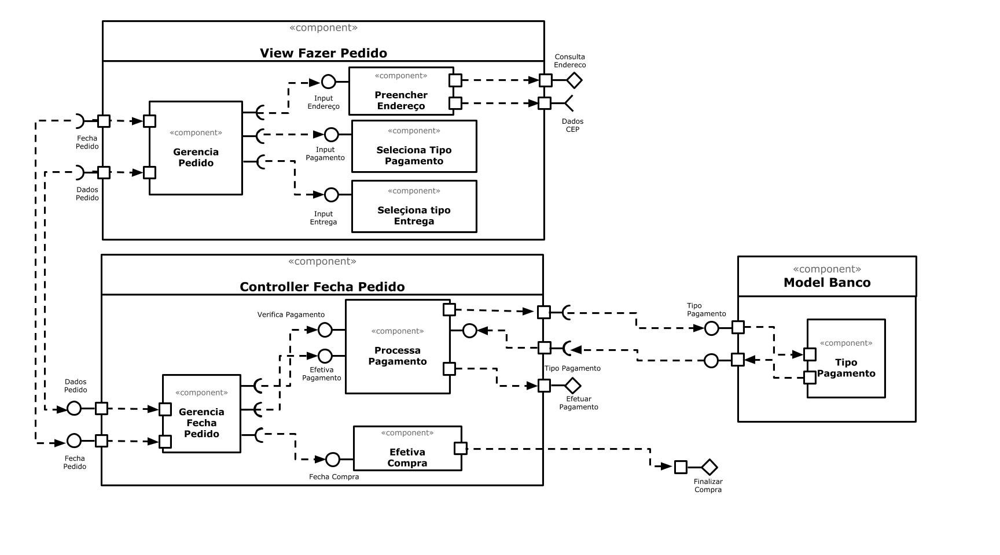

# Apresentação do Lab05 - Subcomponentes e Páginas Dinâmicas

## Tarefa 1

## Tarefa 2

Link para o projeto no Codepen: 
[https://codepen.io/ex106243/pen/bGpxZqb](https://codepen.io/ex106243/pen/bGpxZqb)

código do seu componente:

**HTML**
~~~html

~~~

**JavaScript**
~~~javascript
class Barra extends React.Component {
  render() {
    let resultado = "";
    for (let b = 1; b <= this.props.tamanho; b++)
      resultado += "=";
    return resultado;
  }
}
const monthNames = ["Janeiro", "Fevereiro", "Março", "Abril", "Maio", "Junho", "Julho", "Agosto", "Setembro", "Outubro", "Novembro", "Dezembro"
];

const d = new Date();

const elemento = 

        <h2>O dinossauro</h2>
        <h2>pulou na lama na data de: </h2>
        <h2>{d.getDay()} de {monthNames[d.getMonth()]} de {d.getFullYear()}</h2>
         <Barra tamanho="10"/>
      

ReactDOM.render(elemento, 
        document.getElementById("root"));

~~~